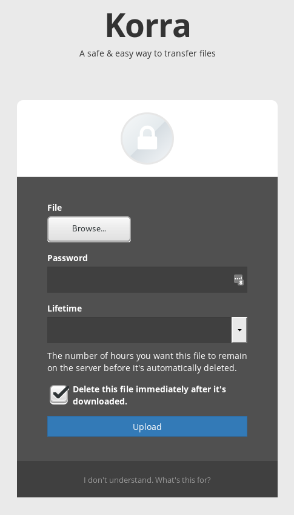
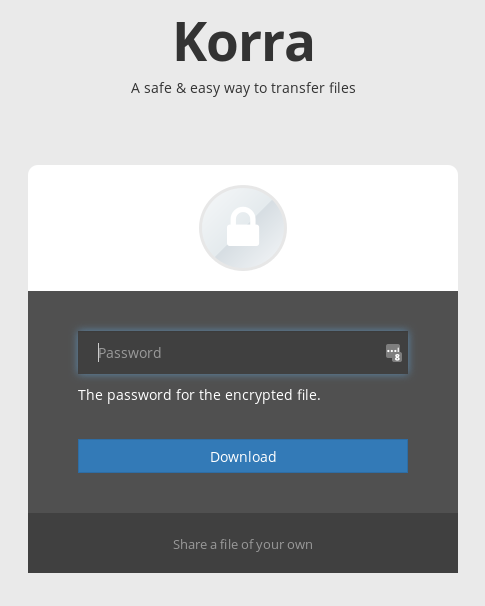

# Korra

Transferring files securely is a pain in the ass, especially if you work
in an office environment where the technologies are heavily fragmented,
and/or you're working with users who are not particularly technically
savvy.

The common denominator for many office environments consists of two
tools: websites and (unencrypted) email.  Slightly more advanced
companies may make use of IRC, Slack, and maybe some combination of
Dropbox and Google Drive.  None of these tools make it easy to transfer
files one-to-one safely & securely, so I wrote this.  Do with it as you
will.

## Installation

As Korra is effectively an anonymous file store, it isn't meant to be a
public web service, lest you run the risk of being an unwitting
participant in distribution of files you may not want to distribute.
Instead, this code is meant to be plugged into a private server
somewhere that's accessible within your office and [secured with HTTPS](https://letsencrypt.org/).

## The User Journey

1. Sender uploads file and gives it a password, and optionally provides
   a time limit value.
2. The server symmetrically encrypts the file and stores it locally.
3. The sender is redirected to a thank you page with a URL for the file.
4. The sender copy/pastes this URL into whatever channel they might have
   to communicate with their target user and passes on the password to
   them (hopefully) by some other means.
5. The recipient goes to the URL, types in the password, and gets the
   file.
6. Depending on the rules set by the sending user, the file is deleted
   once it's been downloaded, or is deleted after a fixed time.

## Why Korra?

Given the nature of this project, I was looking for a name of a famous
medium between parties, someone who helped with communication, and I
settled on the [Avatar](https://en.wikipedia.org/wiki/Avatar:_The_Last_Airbender).
However, given that that word can be ambiguous, I opted for [Korra](https://en.wikipedia.org/wiki/Korra),
in reference to the title character in the excellent Nickelodeon series
[The Legend of Korra](https://en.wikipedia.org/wiki/The_Legend_of_Korra).
